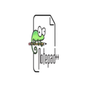

<h1 align="center">Hi there! I'm Umut 👋</h1>

<h2 align="center">
Yeni Yüzyıl University Fine Arts Faculty – Graphic with UI UX Web Design & Web Development Graduated
</h2>

I have a deep passion a Web Development & UI/UX Design passionate about building interactive systems and pixel-driven designs. I enjoy blending art with technology experimenting with 2D and 8-bit pixel art and creating web projects that combine creativity with practical solutions. I like to explore automation scripts, tinkering with creative coding projects and developing small tools that make digital experiences smarter and more engaging. My work reflects a love for clean design, user-centered interfaces, and playful yet functional digital interactions. In my free time I like jogging and walking in the nature, I'm interest of the search science, art, technology and read articles. I like explore variety of interest creativity things.

    

##  📌/root

<strong>🔍 Working on: </strong> Web Development, Mobile Apps, Automation Scripts, Machine Learning, 2D Pixel Games  
<strong>📚 Learning: </strong> C#, Unity, Kotlin, SQLite   
<strong>🛠️ Tools: </strong> Pyhton, Flask, Sublime text, HTML, CSS, JavaScript, Notepad++   

   

<h3 align="center">Languages & Tools:</h3>

  
  
  

<h3 align="center">Connect with me:</h3>

  
  

